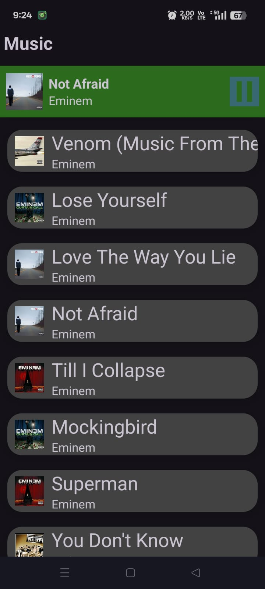
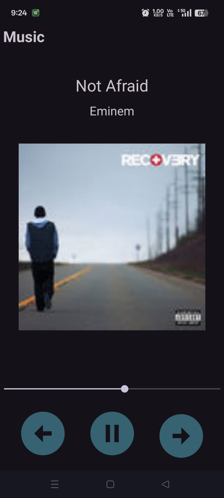

# 🎵 Music Player App

A simple Android Music Player built using **Kotlin**, **Retrofit**, **MediaPlayer**, and **Jetpack Fragments**. It fetches music data from the [Deezer API](https://rapidapi.com/deezerdevs/api/deezer-1/) and allows users to play preview tracks with playback controls and notifications.

## 📱 Features

- Foreground audio playback via `MediaPlayer` in a `Service`
- Play/Pause/Next/Previous track support
- Real-time SeekBar sync using `BroadcastReceiver`
- Persistent notification with media controls
- Using localbinder for direct communication between activity and service (optimisation)

## 🧱 Tech Stack

- **Language**: Kotlin
- **UI**: XML, Fragments, RecyclerView
- **Networking**: Retrofit2, Gson
- **Media**: `android.media.MediaPlayer`
- **Image Loading**: Picasso
- **Architecture**: Service (Foreground and bound )+ BroadcastReceiver communication

## 🚀 Screenshots


| Song List Fragment | Music Player UI | 
|--------------------|------------------|
|  |  | 

## 🧪 Setup Instructions

1. **Clone this repository**
   ```bash
   git clone https://github.com/Manash396/MusicApp.git
   ```

2. **Open in Android Studio**

3. **Set up your Deezer API key**
   - Sign up at [RapidAPI](https://rapidapi.com/deezerdevs/api/deezer-1/)
   - Replace the headers in `ApiInterface.kt`:
     ```kotlin
     @Headers(
         "X-RapidAPI-Key: YOUR_API_KEY",
         "X-RapidAPI-Host: deezerdevs-deezer.p.rapidapi.com"
     )
     ```

4. **Run the app**


## 📜 License

This project is licensed under the MIT License. Feel free to fork, improve, and build upon it.

## 💡 Future Improvements

- Add ViewModel & LiveData for cleaner architecture
- Implement ExoPlayer for better media handling
- Add full track support & search functionality
- Save playback state across app restarts